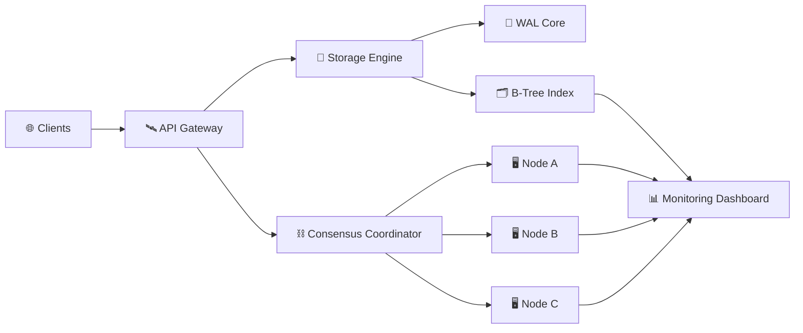

<p align="center">
  
</p>

<h1 align="center">⚡ QUANTUM</h1>

<p align="center">
Distributed Time-Series Database Engine & Vector Storage Fabric
</p>

<p align="center">
  
  
  
  
  
</p>

<p align="center">
  <strong>
  High-performance distributed database infrastructure for time-series workloads,
  vector storage, replication, and real-time analytics.
  </strong>
</p>

---

# 🚀 Overview

QUANTUM is an open-source distributed database engine built for modern high-throughput workloads. It combines durable Write-Ahead Logging (WAL), distributed consensus coordination, B-Tree indexing, and real-time telemetry into a unified platform.

Designed with scalability, observability, and reliability in mind, QUANTUM provides a foundation for next-generation analytics systems, event processing platforms, IoT pipelines, AI infrastructure, and large-scale data services.

---

# 🎥 Live Dashboard Preview

<p align="center">
  
</p>

---

# ✨ Features

| Feature | Description |
|----------|-------------|
| ⚡ WAL Storage Engine | Durable transaction logging and recovery |
| 📈 Time-Series Processing | High-speed ingestion and querying |
| 🧠 Vector Storage Fabric | Foundation for similarity search workloads |
| ⛓️ Distributed Consensus | RAFT-inspired cluster coordination |
| 🔄 Replication Engine | Multi-node synchronization |
| 📊 Observability Dashboard | Live cluster monitoring |
| 🚀 API Gateway | High-throughput request routing |
| 🗂️ B-Tree Indexing | Efficient data retrieval |
| 🧪 Automated Testing | Continuous validation pipelines |
| 🔐 Reliability Focused | Built around fault tolerance principles |

---

# 🏗 Architecture



---

# 🖼 Screenshots

## Dashboard

<p align="center">
  
</p>

## Cluster Monitoring

<p align="center">
  
</p>

## Replication Metrics

<p align="center">
  
</p>

---

# 📂 Repository Structure

```text
quantum/
│
├── .github/
│   └── workflows/
│       └── ci.yml
│
├── api/
│   ├── gateway.py
│   └── routes_map.json
│
├── cluster/
│   ├── node_manager.py
│   └── replica_policy.json
│
├── core/
│   ├── storage.py
│   ├── indexing.py
│   └── kernel_constants.json
│
├── console/
│   └── index.html
│
├── tests/
│
├── docs/
│   ├── assets/
│   └── screenshots/
│
├── Makefile
│
└── README.md
```

---

# ⚙️ Core Components

## 💾 Storage Engine

Responsible for:

- Write-Ahead Logging
- Transaction durability
- Recovery operations
- Data persistence

---

## 🗂 Index Manager

Provides:

- B-Tree indexing
- Fast lookups
- Efficient traversal
- Query acceleration

---

## ⛓ Consensus Layer

Handles:

- Node coordination
- Cluster health
- Leader election
- Replication synchronization

---

## 🚀 API Gateway

Provides:

- Request routing
- Traffic distribution
- Connection handling
- External access layer

---

# 📊 Performance Targets

| Metric | Target |
|----------|---------|
| Write Throughput | 1M+ ops/sec |
| Read Throughput | 2M+ ops/sec |
| Replication Delay | < 5ms |
| Query Latency | Sub-millisecond |
| Cluster Recovery | < 2 seconds |
| Concurrent Connections | 100K+ |

> Replace these numbers with actual benchmark results once available.

---

# 🚀 Quick Start

## Clone Repository

```bash
git clone https://github.com/USERNAME/quantum.git

cd quantum
```

## Run Tests

```bash
make test
```

## Start Engine

```bash
make run
```

## Open Dashboard

```text
console/index.html
```

Open the dashboard in your preferred browser.

---

# 🧪 Testing

Execute the complete validation suite:

```bash
make test
```

The testing framework validates:

- Storage correctness
- Index consistency
- Replication logic
- API behavior
- Cluster synchronization

---

# 🔄 Development Workflow

```text
Fork Repository
        │
        ▼
Create Feature Branch
        │
        ▼
Implement Changes
        │
        ▼
Run Tests
        │
        ▼
Open Pull Request
        │
        ▼
Code Review
        │
        ▼
Merge
```

---

# 🗺 Roadmap

## Version 1.x

- [x] WAL Storage Engine
- [x] API Gateway
- [x] Dashboard Interface
- [x] B-Tree Indexing

## Version 2.x

- [ ] Vector Similarity Search
- [ ] Snapshot System
- [ ] Distributed Sharding
- [ ] Multi-Region Replication
- [ ] Kubernetes Deployment
- [ ] WebAssembly SDK

## Version 3.x

- [ ] Query Planner
- [ ] Columnar Storage Engine
- [ ] AI Query Optimization
- [ ] Streaming Analytics Engine

---

# 🤝 Contributing

Contributions are welcome.

1. Fork the repository
2. Create a feature branch

```bash
git checkout -b feature/amazing-feature
```

3. Commit your changes

```bash
git commit -m "feat: add amazing feature"
```

4. Push your branch

```bash
git push origin feature/amazing-feature
```

5. Open a Pull Request

---

# 📜 License

Licensed under the MIT License.

See the LICENSE file for details.

---

# ⭐ Support The Project

If you find QUANTUM useful:

⭐ Star the repository

🍴 Fork the project

🛠 Contribute improvements

📢 Share it with the community

---

<p align="center">
  Built for high-performance distributed systems.
</p>
