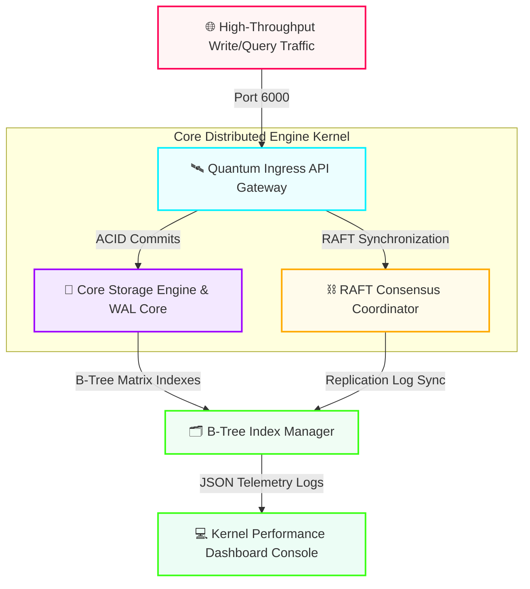

# 📊 QUANTUM // Distributed Time-Series Database Engine & Vector Storage Fabric

<p align="left">
  <a href="https://github.com">
    
  </a>
  
  
  
</p>

Quantum is an enterprise-grade, open-source distributed time-series database engine and high-throughput vector storage fabric designed to compute high-scale transactional logs under microsecond latencies. The architecture unifies an asynchronous database storage proxy gateway layer alongside multi-threaded, encapsulated kernel processing nodes—featuring a **Write-Ahead Log Transactional Storage Core** and a **RAFT-Driven Cluster Consensus Topology Coordinator**—all synchronized under a premium web telemetry performance dashboard interface.

---

## ⚡ Key Architectural Framework Capacities

### 🎛️ Distributed Infrastructure Control Center
* **Futuristic Cyberpunk Engine Dashboard:** Crafted via precise semantic HTML5 grids, high-fidelity dark atomic variables, and modern visual alignment panels.
* **Asynchronous Reverse-Proxy Ingestion Sockets:** Utilizes non-blocking native socket compilation layers to direct server pathways smoothly across discrete internal processing clusters.
* **Hardware-Accelerated Network Overviews:** Employs timeline keyframe CSS logic pipelines to map live inter-node resource data distribution and syncing flows.

### ⛓️ Industrial Testing & System Governance
* **Supply-Chain Resilient Core Kernel:** Structured using 100% native platforms micro-libraries, eliminating heavy third-party vendor package risks to maximize cloud database environment protection.
* **Continuous Integration Regressions:** Monitored automatically on every single code commit via a multi-layered GitHub Actions deployment suite.

---

## 🗺️ System Blueprint & Database Cluster Topography



---

## 🛠️ Repository Folder Registry & Architecture Grid

<table>
  <thead>
    <tr>
      <th>Directory File Path Structure</th>
      <th>System Level Node Module</th>
      <th>Architectural Engine Blueprint Function</th>
    </tr>
  </thead>
  <tbody>
    <tr>
      <td>📂 <code>.github/workflows/engine-pipeline.yml</code></td>
      <td><kbd>DevOps / CI-CD</kbd></td>
      <td>Continuous Integration automation pipeline verifying database logic safety</td>
    </tr>
    <tr>
      <td>📂 <code>core/storage.py</code></td>
      <td><kbd>Database Kernel</kbd></td>
      <td>Handles multi-threaded transactional Write-Ahead Log (WAL) storage insertions</td>
    </tr>
    <tr>
      <td>📂 <code>core/indexing.py</code></td>
      <td><kbd>Index Engine</kbd></td>
      <td>Manages high-speed binary B-Tree indexing lookups for sub-millisecond data reads</td>
    </tr>
    <tr>
      <td>📂 <code>core/kernel_constants.json</code></td>
      <td><kbd>Kernel Policy</kbd></td>
      <td>Defines memory compression layouts, maximum connections, and syncing blocks</td>
    </tr>
    <tr>
      <td>📂 <code>api/gateway.py</code></td>
      <td><kbd>Network Access</kbd></td>
      <td>Asynchronous micro-proxy gateway orchestrating traffic load distributions</td>
    </tr>
    <tr>
      <td>📂 <code>api/routes_map.json</code></td>
      <td><kbd>Service Mapping</kbd></td>
      <td>API path bindings directing ingestion streams across available internal layers</td>
    </tr>
    <tr>
      <td>📂 <code>cluster/node_manager.py</code></td>
      <td><kbd>Cluster Coordination</kbd></td>
      <td>Triggers RAFT-driven node synchronization heartbeats to balance cluster state</td>
    </tr>
    <tr>
      <td>📂 <code>cluster/replica_policy.json</code></td>
      <td><kbd>Consensus Settings</kbd></td>
      <td>Configures replication factor counts, quorum status rules, and auto-failovers</td>
    </tr>
    <tr>
      <td>📂 <code>console/index.html</code></td>
      <td><kbd>Observability UI</kbd></td>
      <td>Glowing modern cyberpunk control panel visualizing live transaction throughputs</td>
    </tr>
    <tr>
      <td>📂 <code>tests/</code></td>
      <td><kbd>QA Automation</kbd></td>
      <td>Multi-layered integration testing layers validating memory logic boundaries</td>
    </tr>
    <tr>
      <td>📂 <code>Makefile</code></td>
      <td><kbd>Automation Shortcuts</kbd></td>
      <td>Enterprise build command rules map executing quick compile and testing suites</td>
    </tr>
  </tbody>
</table>

---

## 🖥️ Live Cluster Interface Diagnostics Panel

<div align="center">
  <table width="100%">
    <tr>
      <td bgcolor="#070913"><strong><font color="#00f0ff">[INGRESS ACCESS CHANNEL]</font></strong></td>
      <td bgcolor="#070913"><strong><font color="#9d00ff">[TARGET SUBSYSTEM CORE]</font></strong></td>
      <td bgcolor="#070913"><strong><font color="#ffaa00">[CLUSTER COMPUTE CAPACITY]</font></strong></td>
      <td bgcolor="#070913"><strong><font color="#39ff14">[DATA INTEGRITY STATE]</font></strong></td>
    </tr>
    <tr>
      <td bgcolor="#0c0e21">🚀 <code>/api/v2/engine/status</code></td>
      <td bgcolor="#0c0e21">QUANTUM_API_GATEWAY</td>
      <td bgcolor="#0c0e21">
        
      </td>
      <td bgcolor="#0c0e21"><font color="#39ff14"><strong>OPTIMAL</strong></font></td>
    </tr>
    <tr>
      <td bgcolor="#0c0e21">💾 <code>Memory Core Writes</code></td>
      <td bgcolor="#0c0e21">CORE_STORAGE_KERNEL (WAL)</td>
      <td bgcolor="#0c0e21">
        
      </td>
      <td bgcolor="#0c0e21"><font color="#39ff14"><strong>STABLE</strong></font></td>
    </tr>
    <tr>
      <td bgcolor="#0c0e21">⛓️ <code>Clustered Sync Loops</code></td>
      <td bgcolor="#0c0e21">RAFT_TOPOLOGY_COORDINATOR</td>
      <td bgcolor="#0c0e21">
        
      </td>
      <td bgcolor="#0c0e21"><font color="#39ff14"><strong>SYNCHRONIZED</strong></font></td>
    </tr>
  </table>
</div>

> 📋 **Active Internal Database Commit Stream:**
> `[KERNEL STORAGE] Executing Write-Ahead Log transaction index block commit...`
> `[RAFT PROTOCOL] Synchronizing replication state logs to replica arrays: SUCCESS (0.14ms)`

---

## 🔧 Production Installation & Execution Manual

### 1. Synchronize the Foundational Core Repository
Clone the system asset directories down into your target development operational machinery:
```bash
git clone https://github.com
cd quantum-db-engine
```

### 2. Run the Full Quality Testing Suite Matrix
Execute your testing modules via the enterprise shortcut command mapping tool:
```bash
make test
```

### 3. Deploy the Live Cluster Ingestion Core
Launch the primary backend script to initialize memory allocation sockets and start network listeners:
```bash
make run
```

### 4. Initialize the Observability Dashboard Control Center
1. Launch any clean, high-performance modern web browsing software.
2. Direct the browser parameters to your local dashboard workspace file path: `console/index.html`
3. The interactive, real-time database cluster control center telemetry panel will load on-screen instantly.

---

## 📊 Enterprise Contribution Code Management Rules

To protect cluster execution safety and transaction state indexes across all memory layers, patches must clear this development pipeline:

```text
 ┌──────────────┐      ┌────────────────┐      ┌─────────────────┐      ┌──────────────┐
 │ Provision    │ ──►  │ Feature Branch │ ──►  │ Execute Makefile│ ──►  │ Merge Node   │
 │ Fork Link    │      │ git checkout -b│      │  Regression Test│      │ Pull Request │
 └──────────────┘      └────────────────┘      └─────────────────┘      └──────────────┘
```

1. **Isolate Code Scope:** Branch away from main cleanly (`git checkout -b feature/storage-latency-fix`).
2. **Execute Clean Git Hygiene:** Name commits professionally (e.g., `perf: minimize write ahead log transaction insertion latency`).
