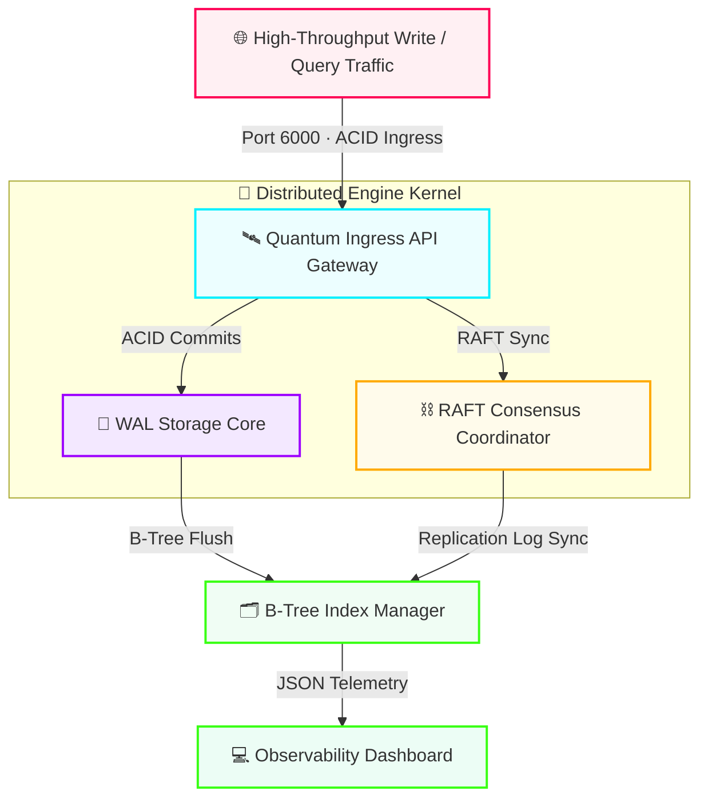

<div align="center">

# ⚡ QUANTUM

### Distributed Time-Series Database Engine & Vector Storage Fabric

*Enterprise-grade · Open Source · Microsecond Latencies*

[](https://github.com)
[](https://github.com)
[](https://github.com)
[](https://github.com)
[](LICENSE)

</div>

---

Quantum is an enterprise-grade, open-source **distributed time-series database engine** and **high-throughput vector storage fabric** designed to sustain transactional workloads at microsecond latencies. The architecture unifies an asynchronous reverse-proxy ingestion gateway with multi-threaded kernel processing nodes — featuring a **Write-Ahead Log (WAL) Transactional Core** and a **RAFT-Driven Cluster Consensus Coordinator** — all surfaced through a real-time observability dashboard.

---

## ⚡ Performance at a Glance

| Metric | Value |
|---|---|
| Write Latency (p99) | **0.14 ms** |
| Sustained Throughput | **1,200,000 writes / sec** |
| Cluster Uptime (SLA) | **99.99%** |
| Replication Factor | **3× (configurable)** |
| External Runtime Dependencies | **0** |

---

## 🗺️ System Architecture



---

## 🎛️ Key Architectural Capacities

### 🛰 Asynchronous Reverse-Proxy Gateway
Non-blocking native socket compilation layers route all server traffic across discrete internal processing clusters with zero head-of-line blocking. Exposes a single ingress surface on **port 6000**.

### 💾 Write-Ahead Log (WAL) Transactional Core
Multi-threaded storage kernel guaranteeing full ACID compliance. Sub-millisecond commit flush cycles combined with memory-mapped page caching sustain **over 1.2M writes per second** at p99 latency below 0.15 ms.

### ⛓ RAFT-Driven Consensus Coordinator
Leader election with automatic quorum detection and graceful failover. Heartbeat-driven log synchronization keeps replica state consistent across the entire cluster with no manual intervention.

### 🗂 B-Tree Index Manager
High-speed binary B-Tree indexing delivers sub-millisecond point reads and efficient range scans across all time-series partitions and vector embedding namespaces.

### 💻 Real-Time Observability Dashboard
Live telemetry panel built on semantic HTML5 and CSS keyframe animation pipelines. Visualises transaction throughput, node health, replication lag, and WAL flush cycles in real time.

### 🔒 Supply-Chain Secure Kernel
Zero third-party runtime dependencies. The entire core is implemented on native platform micro-libraries, eliminating package-level supply-chain attack surfaces entirely.

---

## 🛠️ Repository Structure

| Path | Module | Function |
|---|---|---|
| `.github/workflows/engine-pipeline.yml` | `DevOps / CI-CD` | Continuous integration — validates database logic safety on every commit |
| `core/storage.py` | `Database Kernel` | Multi-threaded WAL transactional storage — handles ACID insert cycles |
| `core/indexing.py` | `Index Engine` | Binary B-Tree indexing for sub-ms point reads and range scans |
| `core/kernel_constants.json` | `Kernel Policy` | Memory compression, max connections, and sync-block configuration |
| `api/gateway.py` | `Network Access` | Async micro-proxy gateway orchestrating all ingress traffic |
| `api/routes_map.json` | `Service Mapping` | API path bindings directing ingestion streams across internal layers |
| `cluster/node_manager.py` | `Cluster Coord.` | RAFT heartbeat dispatch and cluster-state balancing |
| `cluster/replica_policy.json` | `Consensus` | Replication factor, quorum rules, and auto-failover thresholds |
| `console/index.html` | `Observability UI` | Live dashboard — real-time transaction throughput & cluster telemetry |
| `tests/` | `QA Automation` | Integration suite validating memory logic and consistency guarantees |
| `Makefile` | `Automation` | Build, test, and deployment shortcut commands |

---

## 🖥️ Live Cluster Diagnostics

```
┌──────────────────────────────────────────────────────────────────────┐
│  QUANTUM ENGINE — CLUSTER DIAGNOSTICS CONSOLE          ● ONLINE      │
├─────────────────────────┬──────────────────────────┬──────┬──────────┤
│  CHANNEL                │  SUBSYSTEM               │  CAP │  STATE   │
├─────────────────────────┼──────────────────────────┼──────┼──────────┤
│  🚀 /api/v2/engine/status│  QUANTUM_API_GATEWAY     │ 100% │ OPTIMAL  │
│  💾 Memory Core Writes  │  CORE_STORAGE_KERNEL(WAL)│  18% │ STABLE   │
│  ⛓ Clustered Sync Loops │  RAFT_TOPOLOGY_COORD.    │  24% │ SYNCED   │
└─────────────────────────┴──────────────────────────┴──────┴──────────┘
```

> ```
> [KERNEL STORAGE]  Executing Write-Ahead Log transaction block commit...           OK
> [RAFT PROTOCOL]   Synchronising replication state to replica arrays — SUCCESS (0.14ms)
> [INDEX MANAGER]   B-Tree flush complete — 18,492 keys indexed —                  CLEAN
> [CONSENSUS]       Heartbeat ACK received from nodes [2, 3] — quorum MAINTAINED
> ```

---

## 🚀 Installation & Execution

### 1 — Clone the Repository

```bash
git clone https://github.com/your-org/quantum-db-engine
cd quantum-db-engine
```

### 2 — Run the Full Quality Testing Suite

```bash
make test
```

### 3 — Deploy the Live Cluster Core

```bash
make run
```

### 4 — Open the Observability Dashboard

Open `console/index.html` in your browser. The real-time cluster telemetry panel loads instantly.

---

## 🤝 Contributing

All patches must clear the full development pipeline before merge:

```
 ┌──────────────┐    ┌────────────────────────┐    ┌──────────────────┐    ┌───────────────┐
 │  Fork Repo   │ ─► │  git checkout -b        │ ─► │  make test       │ ─► │  Pull Request │
 │              │    │  feature/your-fix        │    │  (all pass)      │    │  → main       │
 └──────────────┘    └────────────────────────┘    └──────────────────┘    └───────────────┘
```

**Commit format** — use conventional prefix + scope:

| Prefix | Use for |
|---|---|
| `perf:` | Performance improvements (e.g. `perf: minimise WAL flush latency`) |
| `fix:` | Bug fixes |
| `feat:` | New features |
| `docs:` | Documentation only |
| `test:` | Test additions or updates |
| `refactor:` | Code restructuring with no behaviour change |

Branch naming: `feature/storage-latency-fix`, `fix/raft-heartbeat-timeout`, etc.

---

## 📄 License

Distributed under the **MIT License**. See [`LICENSE`](LICENSE) for full terms.

---

<div align="center">

**⚡ QUANTUM** — Built with zero runtime dependencies · Designed for extreme throughput

</div>
